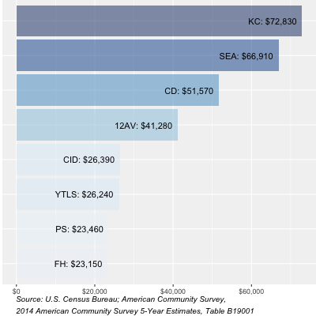

```{r setup, include=FALSE}
knitr::opts_chunk$set(echo = FALSE)
```

## Today's Agenda

1. Introductions <span > </span>
2. Goal Setting
3. Progress Report
4. Methods Discussion
5. Next Steps

# Introductions


## PROGRESS UPDATE: Draft Report Outline {.columns-2}
- **Introduction**
- **Community Characteristics**  
- **Housing**  
- **Transportation**  
- **Environment**  
- **Health & Wellbeing**  
- **Economic Prosperity**  
- **Education**  
- **Real Estate & Development**  
- **Urban Design & Placemaking**  
- **Community & Culture**  
<br>  
<br>  
  


## PROGRESS UPDATE: Data We Have{.columns-2}

- **Introduction**
    + Study area
    + Urban Centers/Villages (most realistic neighborhood boundaries?)
    + Seattle neighborhood boundaries (City Clerk's unofficial boundaries)
 <br>
 <br>
- **Community Characteristics**
    + Household Density  
    + Racial and Ethnic Composition  <br>  
    + Racial Diversity Index  
    + % People of Color  
    + Nativity  
    + English Proficiency  
    + Median Age  
    + Age Distribution (% children, % elders)  
    + Educational Attainment  
    + Median Household Income  
    + % Low Income (below 200% Poverty)  

## PROGRESS UPDATE: Data We Have (cont.) {.columns-2}

- **Housing**
    + Tenure(Rent vs. Own)
    + Types (SF vs. MF)
    + Age of Buildings
    + Cost-Burdening (Renter vs. Owners)
    + Median Gross Rent as % of HH Income
    + Median Gross Rent for Studio, 2BR, 3+BR
 <br>  
 <br>  
  

## PROGRESS UPDATE: Data We Have (cont.) {.columns-2}
- **Transportation**
    + Street network
    + Transit network (% HH > 500ft from transit node)
    + Transit frequency (% HH > 500ft from high freq. transit node)
    + Pedestrian network (% streets with sidewalks)
    + Bicycle network

## PROGRESS UPDATE: Data We Have (cont.) {.columns-2}

- **Environment**
    + Air quality (requires better understanding)
    + Tree canopy
<br>
<br>
- **Health & Wellbeing**
    + Public health facilities (% HH within walking distance)  
    + pea patches + fruit trees  
    + farmers' markets  
    + food stamp accepting businesses  
<br>
<br>
<br>
- **Economic Prosperity**
    + unemployment rate  
<br>   
<br>  
- **Education**
    + Schools  
    + School Performance (WA Schools Report Card - Adequate Yearly Progress)  
<br>
<br>
- **Real Estate & Development**
    + Dupre?  
    + Building permits  
    + Code violations  
    + tax assessor value  
<br>
<br>
- **Urban Design & Placemaking**
<br>
<br>
- **Community & Culture**
    + Ethnic businesses
    + Minority 
    
  
## EXAMPLE MAP

<div class="columns-2">

<iframe  title="Median Household Income" width="600" height="400" src="https://tiernanmartin.github.io/FW-YCC-Baseline-Conditions/4_webcontent/html/lflt_medHhInc.html" frameborder="0" allowfullscreen></iframe>


</div>

## PROGRESS UPDATE: Data We Want

- Better neighborhood boundaries
- More useful education metrics
- Granular environmental data
- Illicit Discharge Detection and Elimination site
- Obesity, activity levels, 

## QUESTIONS FOR YCC


## NEXT STEPS